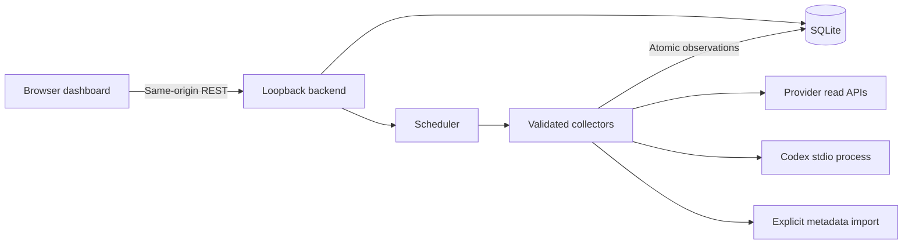

# AI Usage & Reset Tracker — Revised Project Plan

**Type:** Personal, single-user, local-first dashboard  
**Primary platform:** Windows; keep core code portable  
**Reviewed:** 2026-09-17  
**Status:** Build specification; integrations researched, not account-tested

## 1. Product direction and review findings

Help the user answer: **“What capacity do I have left, when might it become available again, and how recent is this information?”** Display each provider's native units and the evidence behind each value. An honest unknown is better than an invented percentage.

Keep the original strengths: a small local application, independent collectors, SQLite persistence, manual fallback, and no cross-provider usage total. The changes below address the original plan's main feasibility and correctness gaps.

| Priority | Finding in the original plan | Revision |
|---|---|---|
| Critical | Historical usage reports were treated as remaining-quota APIs. | Model quotas, balances, rate limits, usage totals, and personal budgets separately. Compute remaining capacity only from compatible measurements. |
| Critical | Cheap inference probes contradicted the promise never to consume quota for monitoring. | Prohibit generation probes. Header-based collection requires an existing observation point; otherwise use manual tracking. |
| Critical | Refreshing another application's OAuth tokens could interfere with its credential lifecycle. | Prefer a documented tool-owned interface; never implement refresh using copied credentials. |
| High | Codex depended on unverified community tools, a presumed JSON file, and fixed windows. | Prefer its documented app-server rate-limit interface; detect capabilities and actual windows. |
| High | Copilot was classified as private-endpoint-only. | Investigate the official personal billing usage API first, including eligibility and current units. |
| High | Gemini Developer API and Vertex AI were combined despite different authentication and quota models. | Separate adapters and configuration. A Gemini API key is not assumed to authorize Cloud Monitoring. |
| High | Cline was assumed to have no separate balance. | Distinguish BYOK from Cline-managed credits/subscriptions. |
| High | Snapshot identity omitted accounts, models, metrics, and windows; the claimed composite key was absent from the SQL. | Use source instances, stable metric keys, atomic collection batches, and explicit current-value pointers. |
| High | Reset expiry and stale manual values had no defined behavior. | Never automatically refill a quota when a countdown reaches zero. Show “Reset due — awaiting update.” |
| High | Loopback binding and `.gitignore` were the entire security model. | Add browser-origin protections, server-only credentials, narrow outbound destinations, safe file access, and redacted diagnostics. |
| Medium | Six integrations were prerequisites for a useful dashboard. | Ship manual tracking first, then one verified automatic source. Gate additional integrations independently. |
| Medium | Summary, history, and packaging scope conflicted across sections. | Define one MVP, explicit follow-on milestones, and measurable exit criteria. |

Provider assumptions were checked against the primary documentation linked in §6. Documentation availability is not proof that an endpoint works for this user's account. No provider credentials, private usage data, or session logs were read during this review. Local checks established only that Codex CLI `0.154.0-alpha.6.1` exposes an experimental app-server command; no account RPC was invoked.

## 2. Goals, boundaries, and success measures

### Goals

- Show enabled tools in one screen, with separate rows for relevant limits or balances.
- Make source, account/project scope, freshness, and unknown values obvious.
- Support useful manual tracking without credentials or network access.
- Automate only meaningful, non-generative reads.
- Survive provider changes, offline operation, sleep/resume, and restarts while retaining last-known observations.
- Keep setup and operation practical for one person on Windows.

### Boundaries

- No generation calls, quota tests, purchases, subscription changes, account switching, automatic earned-reset redemption, or messages to account owners.
- No cloud service, hosted login, sync, telemetry, or remote logging. Enabled provider integrations necessarily make outbound requests; local-first does not mean offline-only.
- No cross-provider monetary/usage total, invoice reconciliation, or conversion from dollars/tokens into estimated messages remaining.
- No browser-cookie extraction, credential-store scraping, reverse-proxy interception, or conversation scanning by default.
- No multi-user or multi-device implementation. Multiple source instances on this machine are supported where scopes differ.
- Personal budgets are optional advisory values, explicitly separate from provider-enforced limits.

### Success measures

- A returning user understands selected tools' remaining capacity, or its absence, within one screen.
- Updating an existing manual metric takes about 10 seconds; initial setup is measured separately.
- Cached dashboard renders within one second after the local server is ready on the target machine with 20 sources and 100 metrics.
- One source failing cannot prevent other cards, manual edits, or scheduled refreshes from working.
- The core dashboard requires no paid request or admin credentials to demonstrate end to end.

## 3. MVP and deferred scope

### MVP: the useful vertical slice

1. Add, rename, disable, reorder with simple up/down controls, and remove sources; ship disabled templates and a custom manual source.
2. Manual entries for percentages, counts, balances, reset-only observations, and unknowns; multiple metrics per source.
3. Cards with remaining/used values where known, truthful progress bars, countdowns, freshness, and a provider link.
4. SQLite persistence, schema migrations, safe storage paths, and backup/recovery instructions.
5. One production automatic collector selected after a feasibility check: Codex app server if compatible, otherwise OpenRouter key information when available. Fixtures are not proof of live integration.
6. Per-source refresh, pause, retry state, explanatory errors, and manual fallback.
7. A lightweight summary: number needing attention and the next known future reset, labeled when manual/derived.
8. Keyboard-accessible responsive UI, system color scheme, and reduced-motion support.

The manual milestone is independently usable. Call the release **automatic MVP** only after at least one real collector is validated. If no eligible credentials/interface are available, ship the manual milestone and identify the remaining validation dependency.

### After MVP

- Add providers actually used, prioritizing reliable remaining capacity over historical reporting.
- Bounded history charts and CSV export; preserve gaps, scope, and reset boundaries.
- Optional desktop notifications, deduplicated per metric/period and suppressed for stale data. Reset notifications say “expected reset” until observed.
- Optional JSON backup/import and UI retention controls.
- Explicit theme override, richer filtering, tray launch, and opt-in start-at-login.
- Desktop packaging after evaluating installer size, subprocess management, updates, and SQLite support on Windows. A Tauri wrapper around a Node backend still needs a managed sidecar or a backend rewrite.

## 4. Capability and trust model

Replace the single numeric tier with independent attributes. An official response header may be unsuitable for polling, and a documented usage API may not expose remaining quota.

| Attribute | Values / meaning |
|---|---|
| Interface | `official_api`, `official_local`, `unofficial`, `manual` |
| Collection mode | `poll`, `local_rpc`, `import`, `observe`, `manual` |
| Metric kind | `quota`, `rate_limit`, `balance`, `usage_total`, `budget` |
| Provenance | `provider_reported`, `user_entered`, `derived`, `estimated` |
| Availability | `unconfigured`, `ready`, `needs_auth`, `unsupported`, `disabled` |
| Coverage | Exact account/project/key/model/region/pool and period, plus known omissions |

“Official” describes an interface, not uptime, precision, account eligibility, or a stability guarantee. Unofficial collection is optional and off by default. Manual fallback is an active user choice; failed collection must not silently change provenance.

A provider definition is reusable; a **source instance** is a configured account/scope, such as “OpenRouter / personal key” or “Vertex / project A / region B.” One source contains multiple metrics. User labels distinguish accounts without requiring email addresses.

## 5. Integration feasibility gate

Before implementing each automatic adapter, write `docs/integrations/<provider>.md` containing:

- Primary documentation URL, checked date, API/client version, and interface status.
- Exact read method/endpoint, credential type, minimum permissions, supported account types, and outbound hosts.
- Scope, units, period, reset semantics, expected delay, and missing capabilities.
- A sanitized fixture with synthetic identifiers and no secrets or conversation content.
- Validation against the matching provider UI/scope/period, allowing documented reporting delay.
- Refresh cadence, validation rules, error mapping, and fallback.

A bounded research spike ends in **implement**, **manual-only**, or **deferred with a named blocker**. Do not spend the project recovering a private endpoint. No community package is a required dependency until its source, maintenance, license, permissions, and credential behavior are reviewed.

Do not infer the user's subscriptions from this document. Start with all templates disabled; onboarding selects actual tools and account modes.

## 6. Provider integration plan

These are documentation-backed candidates as of the review date, not guarantees of live access. Cadences are application defaults, not claims about provider refresh frequency. Every adapter must pass §5.

### 6.1 Codex: first automatic candidate

Prefer documented local app-server RPC `account/rateLimits/read`, with `account/rateLimits/updated` notifications where supported. The documented response includes a multi-bucket view and nullable windows; reset timestamps use Unix seconds. Compatibility is version-specific. Derive labels from returned durations/IDs rather than requiring five-hour and seven-day windows. [Codex app-server documentation](https://learn.chatgpt.com/docs/app-server)

Implementation decisions:

- Capability-check the installed executable and schema. Record the version; the locally inspected CLI labels app-server experimental.
- Use a supervised, fixed-command stdio child process; perform the initialization handshake, correlate request IDs, and enforce timeouts/output limits. Keep it separate from an already-running IDE process.
- Allow only initialization and required account/read-only rate-limit methods. Never expose arbitrary RPC passthrough to the browser or create threads/turns.
- Let Codex own its credential lifecycle. Do not parse, copy, refresh, or overwrite its tokens. Credentials may use files or an OS store, and `CODEX_HOME` can change the location. [Codex authentication](https://learn.chatgpt.com/docs/auth)
- Document that the tool-owned process may perform authentication maintenance. Read-only describes product actions, not a promise that the underlying client never updates its credential cache.
- Verify startup does not activate unrelated integrations or telemetry; use supported overrides where needed. If scoped safe operation is unavailable, defer the adapter.
- Default refresh: five minutes, plus supported notifications; coalesce duplicate requests. API-key login does not imply subscription quota access.
- Display only returned limits for the selected Codex scope; do not advertise comprehensive chatgpt.com model-limit coverage.
- Missing login, unsupported methods, or absent buckets produce an actionable state and manual fallback.

Remove the original dependency on `codex-cli-usage`, `codex-quota`, `~/.codex/usage-limits.json`, and a hardcoded internal HTTP route. Their behavior was not validated. Local token counts cannot reconstruct account-wide subscription capacity. A later importer may ingest actual reported limit observations with original timestamps, but cannot equate token estimates with quota.

### 6.2 OpenRouter: second automatic candidate

Use `GET https://openrouter.ai/api/v1/key` for the configured key's information. It exposes key limits, remaining credit allowance, and reset policy. Lifetime usage must not be subtracted from a resetting allowance. A null key cap does not prove unlimited account credit. [OpenRouter credit and rate limits](https://openrouter.ai/docs/api_reference/limits)

Account-wide `GET https://openrouter.ai/api/v1/credits` is separate; its documentation requires a management key. Do not request broader credentials merely to enable a key-scoped card. [OpenRouter credits endpoint](https://openrouter.ai/docs/api/api-reference/credits/get-credits)

Default refresh: 15 minutes. Display key allowance and account balance separately. Derive exact resets only when the documented schedule/timezone is sufficient; otherwise show the policy without a countdown. Never infer a monthly reset for purchased balances.

### 6.3 GitHub Copilot: official API before private endpoints

Investigate `GET /users/{username}/settings/billing/ai_credit/usage` and the legacy premium-request counterpart. The documented fine-grained user permission is `Plan: read`. Reports concern personally billed usage; organization-funded usage needs its own eligible scope. Validate current API version and account access. [GitHub billing usage API](https://docs.github.com/en/rest/billing/usage)

Copilot billing can use AI credits, while some accounts retain legacy premium-request treatment. Do not hardcode premium requests as the universal unit. Current individual AI-credit documentation describes a calendar-month reset at 00:00 UTC on the first day; apply this only to the matching entitlement. [Individual billing](https://docs.github.com/en/copilot/concepts/billing-and-usage/individuals/billing), [legacy monitoring](https://docs.github.com/en/enterprise-cloud%40latest/copilot/reference/copilot-billing/request-based-billing-legacy/monitor-premium-requests)

Default refresh: 30 minutes. Verify whether the report includes the relevant allowance; usage alone is not remaining entitlement. Do not subtract combined paid/included/flex usage from one pool without documented allocation semantics. If entitlement is unavailable, show usage-only or a separately labeled user-entered allowance. Keep private `/copilot_internal/user` access out of MVP and never extract VS Code tokens.

### 6.4 Anthropic API

The Usage & Cost Admin API is organization-oriented, requires eligible admin credentials, and is documented as unavailable for individual accounts. A normal inference key is insufficient. The usage route includes `/v1/organizations/usage_report/messages`; cost reporting is separate. [Anthropic Usage & Cost API](https://platform.claude.com/docs/en/manage-claude/usage-cost-api)

Treat this as historical usage reporting unless a separate validated source supplies an enforced limit. It does not establish consumer Claude subscription capacity. Default refresh: 30 minutes; the original hourly-only freshness assumption was incorrect. Honor pagination and workspace/model/time scope. Avoid broad admin credentials for a card that does not solve the user's quota problem. Optional cost metrics remain separate from tokens.

### 6.5 OpenAI API

Organization usage and costs are documented separately, including `/v1/organization/usage/completions` and `/v1/organization/costs`. Validate authorized organization credentials, filters, pagination, and actual product coverage. [OpenAI Usage API](https://developers.openai.com/api/reference/resources/admin/subresources/organization/subresources/usage)

Default refresh: 30 minutes. Show measured usage for an explicit period, not ChatGPT or Codex subscription capacity. A completions-only collector identifies that coverage rather than claiming all API products. Do not add overlapping token subtotals, such as cached tokens already included in a total. A user-entered budget is advisory unless a distinct source establishes enforcement.

### 6.6 Groq

Groq documents request and token rate-limit headers with different windows: requests per day and tokens per minute. Reset values can be durations rather than absolute timestamps. [Groq rate limits](https://console.groq.com/docs/rate-limits)

Observation/import only after an explicit integration point exists. A standalone dashboard cannot see another program's HTTPS responses. No scheduled inference ping, even to a free model. Capture only approved rate-limit headers and scope metadata from real calls, never prompt bodies or authorization headers. Timestamp at receipt; importing later cannot make old data fresh. Otherwise use a manual source. Short-window observations are not live availability guarantees.

### 6.7 Mistral API

Mistral documents `X-RateLimit-Remaining`, but this alone does not establish scope, reset time, or compatibility with Groq's schema. [Mistral known limitations](https://docs.mistral.ai/resources/known-limitations)

Default to manual. A later observation adapter must verify actual headers, units, and windows. Preserve unknowns; never copy another provider's reset parsing. No generation probes.

### 6.8 Gemini Developer API

Keep this separate from Vertex. Gemini limits are per project and vary by model; documented daily request limits reset at midnight Pacific time. [Gemini API rate limits](https://ai.google.dev/gemini-api/docs/rate-limits)

MVP: manual quota entries linked to AI Studio. Automation requires demonstrated access to matching usage and limits; a static quota setting cannot establish remaining capacity. Use `America/Los_Angeles` for Pacific calendar rules, not a fixed offset. Do not apply daily resets to minute windows or consumer Gemini chat.

### 6.9 Vertex AI

Optional later adapter requiring a project, location/model, and appropriately scoped monitoring credentials. Verify metric descriptors, alignment, quota dimensions, and delay before promising a percentage. Prefer supported local credentials over requiring a long-lived service-account JSON key.

Vertex supports Dynamic Shared Quota, which has no predefined fixed usage limit. Display quota mode or a supported usage metric rather than a fabricated remaining pool. [Vertex throughput quota](https://docs.cloud.google.com/vertex-ai/generative-ai/docs/resources/throughput-quota)

Default refresh if supported: 15–30 minutes. Defer until permissions and relevant measurements are proven.

### 6.10 Cursor

MVP: manual entries linked to the user's dashboard, separating included usage and on-demand spending. Team analytics exist, but activity reporting does not establish a personal quota endpoint. Avoid the original unsupported blanket claim about Enterprise-only access. [Cursor team analytics](https://cursor.com/docs/account/teams/analytics)

Automate only after validating account type and a suitable interface. No cookie scraping or automated sign-in in MVP.

### 6.11 Cline

Determine provider mode during onboarding. BYOK usage belongs to the upstream account; a Cline label links to that source rather than duplicating its quota. Cline-managed billing has its own credits, and current documentation also identifies a separate subscription provider. [Cline provider documentation](https://docs.cline.bot/getting-started/cline-provider)

Use a separate manual source for managed balance/subscription. Investigate automation only if a documented eligible balance/usage read interface is validated. Do not assume all Cline usage appears under the user's own upstream keys.

### 6.12 ChatGPT, Claude, and Gemini consumer chat

Manual-first templates with editable model/pool names and any number of windows. This review does not establish a supported account-wide quota API for these consumer products; that is an evidence limit, not a claim that no interface can exist.

Support what the UI reveals: percent used/remaining, remaining count, limit reached, or reset time alone. Do not require a made-up percentage when only reset time is visible. Avoid hardcoded plan/model quotas. Provider pages remain the source of truth.

## 7. Architecture and stack

Choose one implementation path for MVP:

- TypeScript throughout; pin a supported Node LTS version during implementation and commit the lockfile.
- Fastify backend, React + Vite frontend, and one shared runtime validation library.
- SQLite through Node 24's bundled `node:sqlite`. Implementation validation replaced `better-sqlite3` after its clean Windows install fell back to an unavailable C++ toolchain; keep SQLite behind a small tested adapter.
- One backend process owns scheduling, database access, provider reads, and supervised subprocesses.
- Same-origin REST with browser polling every 15 seconds while visible. Polls read cached state and do not trigger provider calls. Countdown ticks are client-side; no WebSocket/SSE requirement.
- Per-source completion-based timeouts for scheduling; no external queue or cron dependency.



Development uses Vite's API proxy; production serves assets and API from one origin. Provider parsing stays in adapters; arithmetic/freshness/display rules live in shared domain code. New collectors may also need settings templates and fixtures; do not promise “one file, nothing else changes.”

## 8. Data contract and persistence

### Domain records

| Record | Required meaning |
|---|---|
| Source | UUID, provider, label, account/scope reference, configuration revision, collection mode, enabled flag, order, safe config, secret reference, schedule |
| Metric | Stable key within source; kind, name, unit, pool/model/region dimensions, retirement state |
| Collection run | Source/config revision, start/finish/receipt timestamps, outcome, safe error code, complete/partial coverage, adapter version |
| Observation | Metric/run IDs, original observation time, provenance, values, allowance semantics, period, reset, freshness policy |
| Current value | Explicit latest accepted observation per source/metric, without ambiguity between windows |

Metric keys include dimension IDs and window role, such as `codex:<limit-id>:primary:percent` or `groq:<model>:requests:day`, not a changing reset timestamp. New accounts or incompatible scope/unit changes create new identities; never merge their histories.

### Observation payload

```ts
type Observation = {
  metricKey: string;
  kind: "quota" | "rate_limit" | "balance" | "usage_total" | "budget";
  unit: string; // percent, tokens, requests, usd, github_ai_credits, etc.
  observedAt: string; // UTC ISO-8601; never replaced by import/read time
  receivedAt: string;
  provenance: "provider_reported" | "user_entered" | "derived" | "estimated";
  fieldOrigins?: Partial<Record<
    "used" | "remaining" | "limit" | "usedPercent",
    "provider_reported" | "user_entered" | "derived" | "estimated"
  >>; // required for values with origins different from the observation
  values: {
    used?: string; remaining?: string; limit?: string; usedPercent?: string;
  }; // validated decimal strings; absent is unknown, zero is a real value
  allowance: "finite" | "unlimited" | "unknown" | "not_applicable";
  enforcement: "provider" | "advisory" | "unknown" | "not_applicable";
  limitState: "reached" | "not_reached" | "unknown"; // can be known without counts
  dataThrough?: string; // reporting watermark when provided; not request time
  period?: { start: string; end: string }; // half-open reporting interval
  reset: {
    kind: "fixed" | "rolling" | "refill" | "none" | "unknown";
    at?: string;
    basis: "provider_reported" | "user_entered" | "derived" | "unknown";
    timeZone?: string; // IANA zone for calendar rules
    windowSeconds?: number;
  };
  freshnessSeconds: number;
};
```

Runtime schemas validate untrusted provider/import/manual data. Use decimal-safe arithmetic for money and large counters; convert bounded ratios to numbers for drawing only. Provider metadata is size-limited and allowlisted; do not persist arbitrary raw responses. Preserve field-level origin metadata when a provider value is combined with a user-entered allowance, so mixed evidence cannot appear wholly provider-reported.

### Storage design

Use versioned migrations for these tables; this is a logical contract, not complete migration SQL:

- `sources`: identity/settings and monotonically increasing configuration revision.
- `metrics`: composite primary key `(source_id, metric_key)` and presentation metadata.
- `collection_runs`: attempt outcome, errors, completeness, revision, adapter version.
- `observations`: append-only values, unique `(run_id, source_id, metric_key)`.
- `current_observations`: primary key `(source_id, metric_key)` pointing to an observation of that same metric through a constrained composite foreign key.
- `schema_migrations`: applied versions.

Enable foreign keys on every connection, use WAL and a busy timeout, and index history by `(source_id, metric_key, observed_at DESC)` and runs by source/time. Commit each accepted batch and its current pointers atomically. Reject late results after disable/delete/reconfiguration using the configuration revision.

Default retention: 30 days of observations and seven days of diagnostics. Protect every current observation from cleanup, even if older, so rarely edited manual values survive. Preserve minimal run records referenced by retained observations; prune their diagnostics independently rather than cascading deletion into current/history data. Failures never create zero-valued observations. Cap diagnostic size; clean up at startup and at most daily.

Default Windows data directory: `%LOCALAPPDATA%/AIUsageTracker`, configurable and outside the repository/public asset tree. Document data and credential backup separately. Use SQLite's live backup mechanism, or stop the app before copying; never copy only the main file from an active WAL database. Back up before migrations. Failed migration/corruption gives a recovery message and never silently creates an empty replacement.

## 9. Measurement, reset, and freshness rules

### Arithmetic

- Derive `remaining = limit - used` only for matching unit, period, pool, dimensions, and scope. Prefer provider remaining values when supplied.
- Preserve remaining-only counts without requiring a limit; convert percent remaining to percent used as a labeled derivation. A reported limit-reached state is valid even when all numeric values are unknown.
- Percent-only data supports a percent bar without inventing a message count.
- Missing cap is unknown unless the provider explicitly defines unlimited for that metric. An uncapped key can still belong to an exhausted account.
- Usage-only and balance-only values have no fabricated percent bar. A personal balance alert threshold is not a denominator.
- Zero caps never cause division by zero; use a text state.
- Preserve meaningful overage/negative balances; cap only the visual bar. Reject invalid values rather than silently turning them into plausible data.
- Never sum independent or overlapping limits. Show both caps when either can block use; a percentage alone does not prove model availability.
- A personal budget crossing is not a provider rejection.

### Resets

Store UTC instants and display local time with timezone details. Parse timestamp units explicitly. Convert relative durations using the original response time, not the time a cached file is read.

Countdown expiry means only that the recorded reset is due. Preserve the observation, show **“Reset due — awaiting update,”** and request at most one refresh when allowed. Manual sources say “Check provider and update.” Never mark quota full, roll a weekly window forward, or create a new period without evidence.

Rolling windows can refill progressively. Calendar rules need an actual timezone and correct month/DST handling. Manual resets default to one-off timestamps; recurring rules are deferred unless backed by documented semantics.

Compute countdowns from `resetAt - currentTime`, not accumulated ticks. Recompute on visibility changes/wake. Include absolute time; significant clock skew makes countdowns approximate.

### Freshness and state

Keep transport health and freshness separate. A recent failed check can coexist with old valid data. Reading an old file successfully does not make its data current.

- Details separate last attempt, last successful collection, and observation/data-through time.
- Automatic default stale threshold: twice the interval, adjusted for reporting delay and shorter validity windows. Errors add a warning immediately even if the last observation is still recent.
- Manual default recheck age: 24 hours, adjustable and shortened by a known reset. Always retain the Manual label.
- Lagged reports identify period/data-through time; “checked now” cannot imply real-time data.
- Empty states distinguish not configured, not checked, needs sign-in, and unavailable.
- Partial collection updates valid metrics while marking failed/missing expected metrics individually.
- Retire an absent metric only on explicitly complete authoritative coverage; omission from partial responses is not proof of removal.
- Manual fallback stays active until the user selects automatic mode again. Background collection cannot silently overwrite it.

## 10. Collector and scheduler contract

Each adapter implements bounded `collect(context)`, returning normalized observations, coverage metadata, and per-metric issues. Context contains an abort signal, immutable config revision, clock, scoped transport, and server-only credential access. Adapters neither schedule themselves nor write the database.

Central scheduler behavior:

- One run per source; global concurrency defaults to two. Coalesce timer, notification, and refresh requests.
- Default request timeout: 15 seconds; total run deadline: 60 seconds including pagination. Local RPC initialization/read and output are bounded too.
- Apply small startup/poll jitter, abort on disable/shutdown, and avoid catch-up bursts after sleep. Monitoring stops when the process/machine stops.
- Honor `Retry-After` as seconds or HTTP date. Transient failures use bounded exponential backoff with jitter. Manual refresh cannot bypass provider cooldowns.
- `401/403`: pause aggressive retries with credential/permission guidance. `429`: show next permitted attempt. Network/5xx: retain data and back off. Schema drift: preserve data and request repair, never zero-fill missing fields.
- Paginated aggregates are complete only when all required pages succeed; otherwise retain the previous aggregate and report an incomplete attempt. Deduplicate pages/buckets and never add a reporting range twice.
- Deduplicate notification/import events. Late arrivals cannot replace newer observations merely because they arrived later.
- Persist next allowed attempt and failure state across restart; restarting cannot defeat cooldowns.
- Enforce provider-specific minimum intervals. Default explicit-refresh cooldown: 30 seconds unless a longer restriction applies.
- Bound subprocess restart attempts, terminate owned children on shutdown, and prevent two backend instances from owning one data directory.

## 11. UI and manual entry

### Dashboard

Use the user's order rather than interface tier. Cards show tool and scope labels, a compact source/freshness badge, and one row per metric. Lead with remaining capacity when known; include a relevant total or reporting period. Expand additional rows rather than assuming at most two windows.

Use text/icons with color: normal below 70% used, caution from 70% to below 90%, critical at 90% or above. These are finite quota/budget display defaults, not universal rate-limit health rules. Stale data must not look like fresh green capacity.

Actions: open provider, refresh when supported, edit manual values, and details. Details explain scope, provenance, times, limitations, and safe recovery. Technical interface classifications belong in details; primary badges say Automatic, Manual, Out of date, or Needs sign-in.

Summary uses enabled, non-expired, eligible reset observations. Label manual/derived resets; exclude stale automatic timestamps and advisory budget boundaries from provider-availability claims. Empty state offers templates/custom cards. A visible demo mode uses synthetic fixtures and a separate database; never mix demo data with real accounts.

### Manual workflow

1. Select an existing metric or add a named window/pool.
2. Choose known facts: used/limit, remaining/limit, percent used/remaining, balance, limit reached, or reset only. Unknown is distinct from zero.
3. Enter reset as date/time with visible timezone or duration from now; preview the resulting instant. Observation time defaults to now.
4. Validate contradictions and numeric ranges, then save supplied facts with provenance.

Partial edits preserve untouched fields and offer explicit clearing. An expired reset must be replaced or cleared when updating a period, not silently carried forward. Keep advanced scope fields collapsed. Support keyboard submit/cancel, focus restoration, and inline errors. Use revision checks to prevent two-tab edits from silently overwriting newer values.

### Accessibility and browser behavior

Support narrow layouts, 200% zoom, and keyboard-only use. No color-only status. Progress bars have accessible labels/values; countdown ticks are not announced every second. Time inputs show timezone and handle ambiguous local times. Pause browser polling when hidden; fetch cached state immediately on return.

## 12. Local API and security

All endpoints use runtime validation:

| Endpoint | Behavior |
|---|---|
| `GET /api/state` | Sanitized cached state/revision; no provider calls |
| `POST /api/sources` | Create source |
| `PATCH /api/sources/:id` | Update safe settings/mode with revision check |
| `DELETE /api/sources/:id` | Remove local source/history after clear UI action; remove the referenced local protected key, never revoke provider credentials |
| `POST /api/sources/:id/refresh` | Queue/coalesce read; return accepted/cooldown state |
| `PUT /api/sources/:id/manual` | Atomic validated manual update with expected revision |
| `GET /api/health` | Minimal readiness without account details |

Protect the application, including read APIs, from unintended browser origins:

- Bind to `127.0.0.1`; add `::1` only deliberately. No wildcard/LAN binding by default.
- Validate exact allowed Host/port against DNS-rebinding exposure. No wildcard CORS or permissive proxy trust.
- Require a custom application header on API requests; verify Origin/Fetch Metadata where present. Mutations also require a session-bound CSRF token established through the same-origin UI. Reject cross-site/null-origin and simple form submissions; writes require JSON.
- Vite proxy keeps development same-origin. Test actual request policies in development and production.
- Use restrictive CSP, local assets, escaped strings, and no raw HTML rendering. External links permit only HTTPS and isolate the opener.
- Implemented credential choices: Windows DPAPI CurrentUser encrypted files entered through a write-only UI, or explicit allowlisted server environment references. Settings show configured/missing status, never saved values. No secrets in bundles, persistent browser storage, responses, logs, or SQLite. See docs/how-it-works-and-security.md.
- Keep credential files outside tracked data where practical. `.gitignore` is mandatory but not encryption. Restrict file permissions to the current OS user where supported; Windows-protected storage is implemented; other operating systems currently use environment mode.
- Use fixed provider HTTPS hosts/routes and verified TLS. Reject arbitrary fetch URLs and cross-host redirects; never forward authorization to another origin.
- Imports are explicit, size-bounded, schema-validated metadata files. No API for arbitrary file reads, auth-file access, or arbitrary commands/arguments.
- Start approved executables with argument arrays and no shell. Normal logs allowlist diagnostic fields, excluding raw bodies/stderr, authorization headers, account identifiers, and token-bearing URLs.
- Disable telemetry, including controllable collector subprocess telemetry. Outbound traffic is limited to enabled providers' documented authentication/read hosts.

Threat boundary: malicious web pages, accidental network exposure, and application secret leakage. A hostile process running as the same OS user is outside MVP isolation guarantees; local-only is not protection from local malware.

## 13. Testing and verification

Use synthetic fixtures and fake clocks. Tests target measurement errors, secret boundaries, and failure recovery; normal tests never need real keys or paid requests.

| Area | Required scenarios |
|---|---|
| Arithmetic | Unknown/zero/unlimited; percent-only; zero limit; overage; negative balance; scope/period mismatch; decimal precision; overlapping totals |
| Time | Seconds/milliseconds; relative reset; expired reset; Pacific DST; month/year boundaries; sleep/resume; clock changes |
| Adapters | Multiple/nullable windows; unsupported account mode; schema drift; missing fields; pagination failure; out-of-order events; units |
| Scheduler | Timeout/cancel; isolated failure; no overlap; 429 cooldown; auth pause; restart preserves cooldown; config changes reject late results |
| Storage | Migration fixture; failed migration preserves data; atomic batches; valid current pointers; retention protects manual values; backup/restore |
| UI | Manual revision conflicts; reset-only card; stale values after errors; expired countdown; keyboard/narrow layout; unknown never looks full |
| Security | Invalid Host/Origin; missing header/CSRF; cross-site simple POST; injection-like labels; disallowed URL/redirect/path; redaction |
| Integration | Selected source matches provider scope/period; no generation/action RPC; child shutdown; Windows path with spaces; clean install |

Use Vitest for domain/adapter/backend tests and a small Playwright suite for manual-entry and failure flows. Record live validation separately with provider/client version, account mode, checked date, and comparison outcome, without secrets. Access to every listed provider is not required for the test suite.

## 14. Repository and operating workflow

```text
ai-tool-usage/
  server/
    collectors/          # adapters, capabilities, scoped transport
    domain/              # arithmetic, freshness, reset, validation
    storage/             # migrations, queries, history, backup
    scheduler/
    routes/
    security/
    index.ts
  web/src/
    components/
    pages/
    api/
  shared/                # sanitized API schemas/types
  tests/
    fixtures/            # synthetic responses only
    integration/
    e2e/
  docs/integrations/     # evidence, permissions, limitations
  config.example.json    # safe options and credential reference names
  .env.example           # placeholders only
  .gitignore
  package.json
  README.md
```

SQLite owns editable settings; startup config provides app paths, port, credential references, and explicit deployment overrides. Do not maintain competing writable settings in JSON and SQLite.

Document `npm ci`, `npm run dev`, `npm run build`, `npm start`, `npm run typecheck`, `npm run lint`, `npm test`, and an E2E command. Production serves built assets without a dev server. Verify commands on Windows with spaces in paths. Pin versions, avoid shell-specific scripts, and document native SQLite prerequisites if prebuilt binaries are unavailable.

README covers paths, permissions, setup, manual fallback, freshness/reset semantics, process lifetime, recovery, and uninstall. Closing a browser tab does not stop an independently running backend; stopping the backend stops collection/notifications. Startup-at-login remains opt-in. Port conflicts and locks produce useful messages, never silent fallback to public binding.

## 15. Delivery phases and exit criteria

| Phase | Scope | Exit criteria |
|---|---|---|
| 0 — Validate | Source templates; Codex/OpenRouter feasibility notes; versions and Windows paths | Auto candidate identified or blocker documented; no unverifiable helper-file dependency |
| 1 — Manual dashboard | Schema, cards, setup, edits, countdowns, local API boundary | Works offline without credentials; survives restart; zero/unknown/expired states correct |
| 2 — Automatic slice | One collector, scheduler, freshness, errors, manual fallback | Scoped live comparison passes; disconnect/cooldown paths pass; no generation calls |
| 3 — Harden MVP | Backup, retention, Windows install, security/accessibility, README | Acceptance checklist passes; no unresolved data-loss/secret-exposure issue |
| 4 — More sources | Actual priorities, official Copilot, optional reports/observation adapters | Each passes feasibility and validation; unsupported sources remain manual |
| 5 — Enhancements | History UI, notifications, import/export, tray | Defined benefit and stale/duplicate behavior tests |

Exact Codex windows, six API keys, and unofficial endpoints are not release requirements. Estimate remaining effort after the first feasibility check and working slices, rather than promising a calendar schedule before integration access is known.

## 16. Acceptance checklist

- [ ] Clean Windows checkout installs/builds/starts with documented commands and no credentials.
- [ ] Manual sources support multiple metrics, reset-only data, unknowns, and partial edits; repeated edits take about 10 seconds.
- [ ] At least one eligible automatic adapter is live-validated for an automatic MVP; otherwise label release as the manual milestone.
- [ ] Remaining values match provider scope/period; budgets, balances, reports, and estimates are never mislabeled as guaranteed quota.
- [ ] Countdown expiry never invents capacity; labels/durations come from evidence.
- [ ] Network loss, schema failures, missing permissions, and child exits preserve usable data and unaffected sources.
- [ ] Browser polling and multiple tabs cannot increase provider cadence.
- [ ] Restart, sleep/resume, persistent cooldowns, migration failure, retention, and backup/restore work as specified.
- [ ] Late results cannot undo disable/remove/reconfigure or overwrite manual mode.
- [ ] No generation probes, purchase/reset/action calls, messages, copied OAuth tokens, or conversation ingestion are required.
- [ ] Redaction and Host/Origin/CSRF/outbound restrictions pass targeted tests.
- [ ] Keyboard, narrow-width, and 200% zoom flows work; unknown/stale/manual states are not color-only.
- [ ] Every enabled auto source has checked evidence, limitations, and a recovery/manual path.

## 17. Open decisions with non-blocking defaults

| Decision | Default until actual setup establishes otherwise |
|---|---|
| Which tools/accounts matter most? | Nothing enabled initially; user selects and orders templates. |
| Codex executable/login supports reads? | Capability-check, then manual if unsupported; never alter installation automatically. |
| Admin/reporting credentials worthwhile? | Optional; unavailable permissions do not block the project. |
| Cline mode? | Onboarding distinguishes BYOK link from managed credits/subscription. |
| Historical reports or immediate quota visibility? | Prioritize remaining capacity; usage-only adapters optional. |
| Existing header observation point? | Assume none; do not make a proxy a hidden prerequisite. |
| Tray/background startup? | Explicitly started backend plus browser first. |
| Retention/portability? | 30-day history, protected current values, local backup, no sync. |

Preserve these semantics when providers change. Update evidence notes and adapters together, and prefer a clearly limited manual source over plausible-looking incorrect data.

## Implemented extension: reset reminders (v1.2)

Each metric with a known reset can have a persistent alarm. In-app reminders, optional browser sound/desktop notifications and per-alarm SMTP email are implemented. The scheduler follows observed timestamps, suppresses repeated occurrences, bounds SMTP retries and records uncertain delivery instead of blindly resending. See docs/reset-reminders.md for setup, security, timing and recovery limits.


## Implemented extension: API-key reporting (v1.3, 2026-09-17)

Protected UI entry and explicit server environment selection now support OpenAI API, Anthropic API, Cursor, GitHub Copilot, Mistral and DeepSeek API in addition to OpenRouter. Source creation opens credential setup immediately. Credentials and report scopes differ by provider; costs/balances are not subscription quotas and do not imply reset timestamps. See [the implemented integration matrix](docs/integrations/key-providers.md). Unsupported reporting integrations remain manual. Schema v3 and existing reset alarms are preserved.
