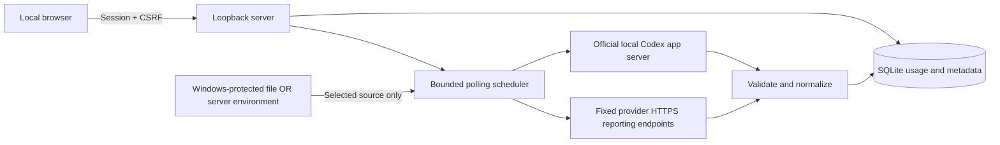

# How Quota collects AI usage and protects credentials

Updated 2026-09-17. This describes the implemented application, not promised integrations.

## What the system actually does

Quota is a single-user application running on your computer. React displays the dashboard; a Fastify server binds to `127.0.0.1`; Node 24's SQLite implementation stores source settings, observations, and collection status. The browser never calls provider APIs directly. Vite builds the static frontend; it is not the production server.

Automatic collection is implemented for **Codex, OpenRouter, OpenAI API, Anthropic API, Cursor, GitHub Copilot, Mistral and DeepSeek API**. See [key integration details](integrations/key-providers.md) for required permissions and report semantics. A provider template or an API key does not make another tool automatic. Manual sources work offline: the user copies observations from the provider, and Quota records their observation time and provenance. It does not read chats, infer consumption from prompts, intercept traffic, or scrape browser sessions.

## Coverage for every available tool

| Tool | Implemented collection | What to track and important scope limits |
|---|---|---|
| Codex | Automatic official local app-server reads; manual alternative | Returned ChatGPT-backed Codex quota windows. Not ChatGPT chat usage or OpenAI API billing. |
| OpenRouter | Automatic authenticated `GET /api/v1/key`; manual alternative | This key's allowance and lifetime usage. Not total account funds or every key in an account. |
| Claude | Manual | Copy the relevant subscription window and reset from the provider UI. No consumer-session token extraction. |
| ChatGPT | Manual | Record the specific displayed model/tool limit. Codex windows do not establish ChatGPT chat capacity. |
| Cursor | Automatic team admin report; manual alternative | Team billing-cycle overall and on-demand spending; on-demand is included in overall. |
| GitHub Copilot | Automatic personal billing report; manual alternative | Current-month gross/net AI-credit usage; excludes organization-paid usage and legacy premium-request reports. |
| Gemini chat | Manual | Consumer chat limits are separate from Gemini API quotas. |
| Anthropic API | Automatic organization admin cost report; manual alternative | Completed UTC days this month; excludes Priority Tier and consumer Claude. |
| OpenAI API | Automatic organization admin cost report; manual alternative | Organization reported costs this UTC month; no project filter or subscription quotas. |
| Groq | Manual | Record the actual model/account rate window; no synthetic requests are made to probe limits. |
| Mistral | Automatic Enterprise Admin API status; manual alternative | Monthly completion limit reached/not reached only; no counts or reset. |
| DeepSeek API | Automatic account balance; manual alternative | Separate USD/CNY balances; no consumer chat usage. |
| Gemini API | Manual | Track the relevant project/model/window from AI Studio. Static limits alone do not establish remaining capacity. |
| Vertex AI | Manual | Record project, location, model and window explicitly. No monitoring credentials are requested. |
| Cline | Manual, or use the upstream source | Track Cline-managed credits separately. For BYOK usage, prefer the upstream provider; avoid counting the same spending twice. |
| Custom | Manual | User-defined counts, percentages, balances, budgets, reset-only or unknown observations. |

These are implementation limits; they are not claims that the other providers have no official reporting APIs. Adding an adapter requires validating its account eligibility, permissions, scope, pagination, delay, units, limits, and error semantics first.

## Codex: how an automatic reading is possible

The backend starts the installed native Codex executable as a short-lived app-server subprocess. It uses the official initialization handshake, `account/read` with `refreshToken: false`, and `account/rateLimits/read`. Codex owns its existing ChatGPT authentication. The tracker does not open or modify `auth.json`, copy OAuth credentials, submit prompts, or invoke generation. The underlying CLI may maintain its own authentication state.

Responses are validated before storage. Multiple limit buckets and nullable windows are supported. Window labels use the returned duration; percentages remain percentages; Unix timestamps are converted to UTC. No fixed five-hour/seven-day assumption or credit-pool coverage is invented. The subprocess has a deadline and output-size bound and is terminated after use. Its environment is allowlisted so tracker provider keys are not inherited.

An email-derived hash detects some account switches. It cannot distinguish workspaces under the same email, and a missing email cannot establish identity. Create a separate source when changing workspace. The installed interface is experimental and must be revalidated after CLI upgrades. See [adapter evidence](integrations/codex.md) and the [official app-server documentation](https://learn.chatgpt.com/docs/app-server).

## OpenRouter: how an automatic reading is possible

The backend sends a bearer token only to the fixed HTTPS endpoint `https://openrouter.ai/api/v1/key`. It reads the selected key's `limit`, `limit_remaining`, and `usage`. Allowance used is derived from limit minus remaining; lifetime usage is displayed separately. A null key cap does not establish unlimited account funds. The adapter does not invent a reset timestamp, query account-wide credits, or use management operations. It does not submit inference requests. The underlying key may nevertheless permit paid inference: this app's read-only behavior does not reduce the key's provider permissions. See the [official current-key endpoint](https://openrouter.ai/docs/api/api-reference/api-keys/get-current-api-key).

Each supported key-based source chooses its own credential method. After the first successful read, a SHA-256 key fingerprint prevents another key's readings from being merged into that history. Switching storage methods for the same key is fine. For a genuinely different or rotated key, create a new source; pause the old source to preserve its history.

Minimum polling is 15 minutes, with jitter. Requests have a 15-second HTTP timeout, a 100 KB body limit, TLS verification and redirect rejection. Authentication failures pause retry; rate limits honor Retry-After; other failures back off. No live OpenRouter key was supplied for release verification, so live account validation remains a setup check.

## Setting up credentials

1. Add a supported key-based source. Credential setup opens immediately; existing sources use **Source settings**.
2. Under the provider credential heading, choose a storage method.
3. For **Windows-protected key**, paste the key into the password field and select **Save credential settings**. Saved values cannot be retrieved through the UI. Replacing a value requires entering it again.
4. For **Server environment variable**, enter the provider default variable or a dedicated provider-prefixed name from the [integration matrix](integrations/key-providers.md). Set that variable in the backend environment or ignored `.env`, then restart the backend.
5. Select Automatic and save the source settings. Check that a successful observation appears and compare its scope/value with the provider dashboard.

Credential settings have their own save button. Source settings and credential settings are separate revision-checked operations. The UI clears the password on submission, including failed submissions. A failed save requires pasting again. It never writes the key to browser localStorage, sessionStorage, or IndexedDB. The entered key necessarily exists temporarily in browser/server memory and in the browser's outgoing request; password masking is not encryption.

Environment-variable names are restricted to each selected provider's exact default name or dedicated prefix plus 1-80 uppercase letters, digits or underscores. Both save and resolution enforce this isolation. The dashboard cannot select arbitrary process secrets or another provider's variables. New integrations default to disconnected until explicitly configured; legacy OpenRouter defaults remain compatible. Never use `VITE_*` for secrets.

**Remove credential / disconnect** deletes the saved protected file and disables credential resolution for that source. Switching to environment mode also removes the old protected file. There is no fallback between methods. These actions do not revoke a provider key, modify `.env`, or delete usage history. Revoke compromised keys at the provider.

## Protection at rest and its limits

On Windows, .NET `ProtectedData` uses DPAPI with `CurrentUser` scope. Ciphertext is stored in `<data-directory>/credentials/<random-id>.dpapi`; SQLite stores only the selected method, environment name or opaque reference. The secret is delivered to a fixed PowerShell helper over an anonymous pipe, not command-line arguments, environment variables, logs, or a plaintext temporary file. The helper has a timeout, bounded output, no profile loading and suppressed stderr. See [Microsoft's data-protection documentation](https://learn.microsoft.com/en-us/dotnet/standard/security/how-to-use-data-protection).

New blobs have random immutable names. A database transaction switches the reference only after encryption succeeds and rechecks the source revision. Failed/stale saves discard the new blob; successful replacement removes the previous blob. Credential writes are serialized and capped at 12 attempts per minute. A crash between file creation/cleanup and the database commit can leave an unreferenced encrypted blob; it cannot expose plaintext. File deletion is not a promise of secure erasure from disks or external backups.

DPAPI relies on the Windows user profile. The app requests owner-only POSIX modes, but Windows uses the data directory's inherited ACLs; this release does not install a custom ACL policy. Keep the directory under your private user profile. Do not share it or place it under a public web root. Protecting the whole machine and disk remains valuable because usage history and `.env` are not encrypted by this app.

Environment mode is useful when credentials are supplied by a trusted launcher or secret manager. A `.env` file is plaintext and is **not inherently safer than DPAPI**. Environment values also exist in the backend process. Both methods are outside the isolation guarantees for malware running as the same OS user, browser extensions with access to this page, administrators, debuggers, or a compromised provider/CLI. Protected UI storage is unavailable off Windows; environment mode remains available.

## Browser and server safeguards

- Bind only to IPv4 loopback; exact allowed Host validation defends against DNS rebinding.
- Validate Origin and Fetch Metadata; require a custom dashboard header for protected API calls.
- Signed HttpOnly, SameSite=Strict local session cookies expire after 12 hours. Mutations require JSON and a session-bound CSRF token.
- CSP restricts scripts/connections to this origin; framing is denied. Responses use no-store, no-sniff and no-referrer policies.
- No secret-read endpoint exists. Credential status returns method/configured state, never the key or protected-file reference.
- Request schemas reject unknown fields. Validation and operational failures avoid reflecting supplied secrets; request logging and raw provider-body logging are disabled.
- Fixed provider destinations and executable argument lists avoid configurable outbound URLs and shell interpolation.
- Request/body/output bounds, two-collector concurrency, deadlines, persisted backoff and configuration revisions limit runaway work and stale updates.

Local HTTP is intentional for this single-user loopback deployment. This is not an internet-ready multi-user service. Local sessions protect browser interactions; they do not authenticate separate operating-system users or prevent another local process from opening a session.

## Interpreting the dashboard correctly

Each observation records its metric kind, native unit, scope, time, provenance and freshness budget. Unknown is not zero. An unlimited key cap is not an unlimited account. Personal budgets are advisory, not provider enforcement. A reset countdown reaching zero marks the reading reset-due; it never replenishes a quota without a new observation. Errors retain the last good reading and show its age. Different units and provider scopes are never added into one quota total.

Polling runs only while the backend and computer run. Missed intervals are coalesced when resumed. Default Codex polling is five minutes; OpenRouter and DeepSeek have a 15-minute minimum; other key integrations use 30 minutes, except Cursor at 60 minutes. A source can be paused or switched to manual without deleting prior readings. Manual values identify user entry; editing provider observations cannot silently relabel arbitrary values as provider-reported.

## Data, backups, updates and recovery

Default Windows data: `%LOCALAPPDATA%/AIUsageTracker`. Override using `AI_TRACKER_DATA_DIR` only to a private location. SQLite uses WAL, foreign keys, transactional writes, integrity/version checks and a single-instance lock. Schema v2 adds credential metadata; existing v1 OpenRouter sources retain their existing `OPENROUTER_API_KEY` behavior. Migration backs up an existing v1 database first.

`npm run backup` creates an online SQLite backup containing usage/history and credential metadata, **not protected blobs or environment values**. Restoring a database alone may leave credential references unresolved, especially after replacement/removal; reconfigure those sources. A copy of an encrypted blob is not a portable key export. Keep provider recovery access independently; do not rely on migrating DPAPI files to another Windows account or machine.

Stop the server before restoring a database; preserve the original database and its WAL/SHM files together. Follow the [README recovery procedure](../README.md#backup-restore-and-recovery). Current readings are retained; ordinary history ages out after 30 days and diagnostics after seven days. Deleting a source removes its local history and referenced protected file, not the provider account. Protect backups because names, scopes, usage and timestamps can be private.

See [deployment readiness](deployment-readiness.md) for verified checks and remaining limits.

## Reset reminder extension (schema v3)

Per-window alarms now record scheduled reset occurrences in SQLite and optionally send email via the configured SMTP account. Reminder email intentionally sends the tool name, window label, reset time and recipient outside the device; API keys and SMTP credentials are excluded. See [reset reminders](reset-reminders.md) for setup, browser limitations, delivery semantics and backup considerations.
